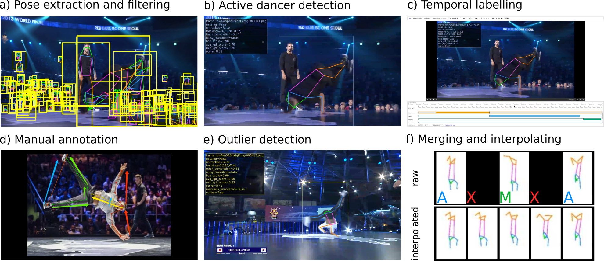

# Introduction



This repository contains the dataset published with the ECCV 2022 paper 
"**BRACE: The Breakdancing Competition Dataset for Dance Motion Synthesis**".

## What is BRACE?

- A new dataset for audio-conditioned dance motion synthesis
- Focuses on breakdancing sequences
- Contains high quality annotations for complex body poses and dance movements

### BRACE at a glance

| Property                   | Value        |
|:---------------------------|:-------------|
| Frames                     | 334,538      |
| Manually annotated frames  | 26,676 (8%)  |
| Duration                   | 3h 32m       |
| Dancers                    | 64           |
| Videos                     | 81           |
| Sequences                  | 465          |
| Segments                   | 1,352        |
| Avg. segments per sequence | 2.91         |
| Avg. sequence duration     | 27.48s       |
| Avg. segment duration      | 9.45s        |

### Video

You can watch our [supplementary video](http://www.youtube.com/watch?v=IIL7yeALxaQ) to 
have a look at BRACE and our paper. 

# Download

## Keypoints

You can download our keypoints 
[here](https://github.com/dmoltisanti/brace/releases/download/v1.0/dataset.zip).

Notice that keypoints are split into **segments**, i.e. the shorter clips that compose 
a sequence (please refer to our paper for more details). 
We provide Pytorch code to load these segments keypoints as sequences (see below).

Keypoints are JSON files organised in folders as follows:

```
├── year
│ ├── video_id
│ │ ├── video_id_start-end_movement.json
```

Where `video_id_start-end_movement` denote the corresponding information about the segment. 
For example `3rIk56dcBTM_1234-1330_powermove.json` indicates:
- video_id: `3rIk56dcBTM`
- start: `1234`
- end: `1330`
- movement: `powermove`

Start/end are in frames. Movement can be one of `(toprock, footwork, powermove)`. 

The content of the JSON files is
a dictionary where keys are frame IDs in the format `video_id/img-xxxxxx.png`, 
where `xxxxxx` is the 6 digit (0 padded if necessary) frame number. Each frame ID indexes a dictionary with
two values: `box` and `keypoints`. `box` is a 5-element list containing the coordinates of the dancer 
bounding box, in the format `(x, y, w, h, score)`. `keypoints` is a 17-element list containing the 
human joints coordinates in the format `(x, y, score)`. 
The order of the keypoints follows [COCO](https://cocodataset.org)'s format. 
All coordinates are in pixel (area: 1920x1080) and all `score` values are 1
(we kept them for compatibilities with other libraries).

## Manually annotated keypoints

You can find the 26,676 manually annotated keypoints 
[here](https://github.com/dmoltisanti/brace/releases/download/mk_v1.0/manual_keypoints.zip).
These are provided as numpy arrays (`npz` files) organised in a similar structure as the interpolated keypoints:

```
├── year
│ ├── video_id
│ │ ├── img-xxxxxx.npz
```

Where `img-xxxxxx` is the frame ID, as seen above. Keypoints can be loaded as follows

```python
import numpy as np
keypoints = np.load('path_to_npz_file')['coco_joints2d'][:, :2]
```

`keypoints` will then be a numpy array of shape (17, 2) containing the annotated nodes coordinates.
These are also in pixel and follow the COCO format just like the segment keypoints. 
Notice that arrays actually have shape (17, 3), however the last column axis `[:, 2]` is not meaningful.
Make sure you load these files as suggested with the snippet above to load arrays correctly.

## Audio features for sequences

You can download pre-extracted audio features
[here](https://github.com/dmoltisanti/brace/releases/download/af_v1.0/audio_features.zip).
The audio files for these features were obtained trimming the videos' full audio
following the sequences' start and end times.

We extracted features using 
[Dance Revolution](https://github.com/stonyhu/DanceRevolution/blob/3d85c0a687f150684b4b09caa4452aa0048377f9/prepro.py#L35)
's code. Specifically, we extract the following:

- mel frequency cepstral coefficients (MFCC)
- MFCC delta
- constant-Q chromagram
- onset envelope 
- onset beat
- tempogram

Sampling rate for these was set to 15360.
Please refer to 
[Dance Revolution](https://github.com/stonyhu/DanceRevolution/) for more details.
Files are organised as follows:

```
├── video_id
│ ├── video_id.sequence_idx.npz
```

Where `video_id.sequence_idx` corresponds to the sequence `uid` (see annotations below).
Features are saved as numpy files, which you can load as follows:

```python
import numpy as np
features = np.load('path_to_feature_file.npz')
```

`features.files` contains the 6 audio features listed above:

```bash
features.files
['mfcc', 'mfcc_delta', 'chroma_cqt', 'onset_env', 'onset_beat', 'tempogram']
```

Each of these is a numpy array, which you can access like you
query a dictionary, e.g. `features['mfcc']`. 
Each array is 2D with shape `(feature_dim, temporal_dim)`.

## Videos and frames

We used `youtube-dl` to download the videos from YouTube 
(links are provided in [video_info.csv](https://github.com/dmoltisanti/brace/blob/main/videos_info.csv))
using: 

```bash
format: bestvideo[ext=mp4],bestaudio[ext=m4a]
``` 

To extract frames we simply used `ffmpeg` without re-encoding the videos:

```bash
ffmpeg -i ./path_to_videos/${video_id}.mp4 ./path_to_frames/${video_id}/img-%06d.png
```

Where `video_id` is the YouTube video ID.

# Annotations

You will find our annotations under the folder `annotations` in this repo. 
Here we provide the details of each file.

## `segments.csv`

This file annotates segments, i.e. the shorter dance units a sequence is composed of
(more details in our paper). The file contains the following columns:

- `video_id`: YouTube video ID
- `seq_idx`: index of the sequence a segment belongs to
- `start_frame`: start of the segment in frame
- `end_frame`: end of the segment in frame
- `dance_type`: type of the dance segment, either `(toprock, powermove, footwork)`
- `dance_type_id`: numerical ID of the dance type: `{0: toprock, 1: powermove, 2: footwork}`
- `dancer`: name of the dancer
- `dancer_id`: numerical ID of the dancer
- `year`: year of the competition/video
- `uid`: unique ID of the segment

## `sequences.csv`

This file annotates sequences, i.e. a series of segments. 
Each sequence corresponds to one of the sequences a dancer performs 
in the corresponding video. 
The file contains the following columns:

- `video_id`: YouTube video ID
- `seq_idx`: index of the sequence, i.e. the order in which it appears in the video
- `start_frame`: start of the sequence in frame
- `end_frame`: end of the sequence in frame
- `dancer`: name of the dancer
- `dancer_id`: numerical ID of the dancer
- `year`: year of the competition/video
- `uid`: unique ID of the sequence

Note that there may be gaps between the indicated 
start/end times (i.e. missing frames). 
In fact, these times correspond to the start of the first segment and 
the end of the last segment. While most segments are contiguous, 
in few cases we could not label some parts of the videos 
due to aerial or very distant views.   

## `sequences_{train,test}.csv`

These files identify the training/testing splits we used for our experiments.
They contain two columns to uniquely identify a training or testing sequence:

- `video_id`: YouTube video ID
- `seq_idx`: index of the sequence, relative to the video
- `uid`: unique ID of the sequence

## `audio_beats.json`

This JSON file contains the sequences' audio beat information, extracted with
[Essentia](https://essentia.upf.edu/reference/std_RhythmExtractor2013.html).
Information is organised as a dictionary where keys are sequences `uid` (see above).
Each key indexes a dictionary containing:

- `bpm`: the beat per minute of the audio track
- `beats_confidence`: the confidence of Essentia's beat extractor algorithm
- `beats_sec`: list of beat positions, in seconds
- `beats_frame`: list of beat positions, in frames

Like audio features, beats info is relative to audio sequences 
(i.e. the video audio trimmed using the annotated sequence start/end times).

## `shot_boundaries.json`

This JSON file contains the shot boundaries 
we detected with [Scene Detect](https://pyscenedetect.readthedocs.io/en/latest/).
This file is a dictionary where keys are YouTube video IDs and values are lists of
frame indices where shot changes were detected.

# Pytorch dataset

We prepared a Python script that loads BRACE as a PyTorch dataset. 
This is the file `utils/dataset_pytorch.py`. 
You can use this file as follows (see also the `__main__` function there):

```python
    import pandas as pd
    from pathlib import Path
    # adjust csv paths if you don't run this script from the `utils` folder

    sequences_path_ = Path('../dataset')  # path where you download and unzipped the keypoints
    df_ = pd.read_csv(Path('../annotations/sequences.csv'))

    train_df = pd.read_csv('../annotations/sequences_train.csv')
    train_df = df_[df_.uid.isin(train_df.uid)]

    brace_train = BraceDataset(sequences_path_, train_df)
    skeletons_train, metadata_train = brace_train.__getitem__(0)

    test_df = pd.read_csv('../annotations/sequences_test.csv')
    test_df = df_[df_.uid.isin(test_df.uid)]

    brace_test = BraceDataset(sequences_path_, test_df)
    skeletons_test, metadata_test = brace_test.__getitem__(0)
```

# Help

If you need help with BRACE, just create a [new issue](https://github.com/dmoltisanti/brace/issues/new/choose)
in this repository.

# Citation

Please cite our paper if you use BRACE:

```bibtex
@InProceedings{moltisanti22brace,
author = "Moltisanti, Davide and Wu, Jinyi and Dai, Bo and Loy, Chen Change",
title = "BRACE: The Breakdancing Competition Dataset for Dance Motion Synthesis",
booktitle = "European Conference on Computer Vision (ECCV)",
year = "2022"
}
```